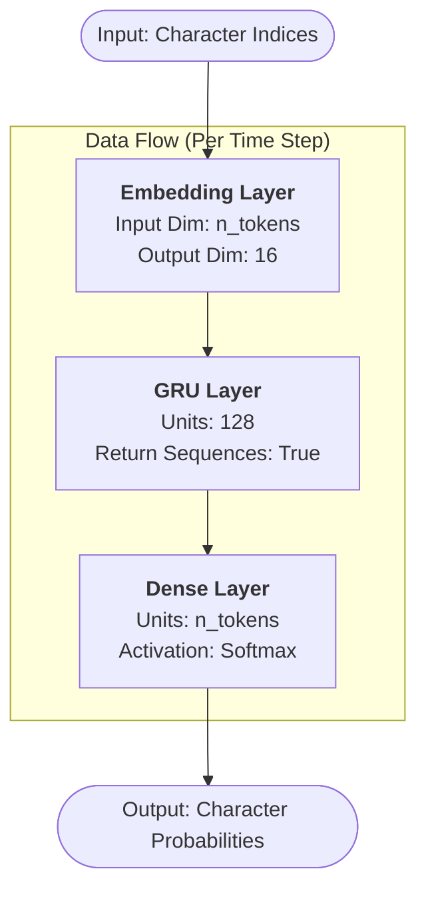

<!-- meta-title: NLP 與注意力機制完整指南：情感分析、機器翻譯、多頭注意力 -->
<!-- meta-description: 深入 NLP 深度學習：字符級 RNN 文字生成、溫度採樣、Stateful RNN、詞嵌入情感分析、Encoder-Decoder 機器翻譯、Bahdanau 注意力機制，以及 Keras 多頭注意力層。 -->
<!-- meta-keywords: Python, NLP, RNN, LSTM, 注意力機制, 機器翻譯, 情感分析, Transformer, Keras, TensorFlow -->
<!-- meta-hashtags: #Python #NLP #DeepLearning #RNN #LSTM #Attention #Transformer #MachineTranslation #SentimentAnalysis #Keras #TensorFlow #DataScience -->

# 🐍 NLP 與注意力機制：從文字生成到 Transformer 基礎

從 GPT 到 BERT，現代 NLP 的核心都是**注意力機制（Attention Mechanism）**。本教學帶你走過 NLP 深度學習的完整路徑：字符級 RNN 文字生成、詞嵌入情感分析、Encoder-Decoder 翻譯系統，最終理解多頭注意力——Transformer 的核心組件。

## 📝 本文目錄

- [🎯 關鍵重點](#key-takeaways)
- [✍️ 字符級 RNN 文字生成](#char-rnn)
- [🌡️ 溫度採樣](#temperature)
- [💬 詞嵌入情感分析](#sentiment)
- [🔄 Encoder-Decoder 機器翻譯](#encoder-decoder)
- [🎯 注意力機制](#attention)
- [🤖 多頭注意力（Transformer 基礎）](#multihead-attention)
- [❓ 常見問答](#faq)
- [🏷️ 推薦標籤](#hashtags)

## <a id="key-takeaways"></a>🎯 關鍵重點 (Key Takeaways)

- **字符級 RNN** 學習字符序列的統計規律，可生成新文字（但不理解語義）
- **溫度（Temperature）** 控制生成的創意度：低溫 → 保守（重複）；高溫 → 創意（隨機）
- **詞嵌入（Word Embedding）** 將詞語映射到密集向量空間，語義相近的詞距離相近
- **注意力機制** 讓解碼器在生成每個詞時，能「關注」源序列中最相關的部分
- **`MultiHeadAttention`** 是 Keras 內建的多頭注意力層，是 Transformer 架構的核心

---

## <a id="char-rnn"></a>✍️ 字符級 RNN 文字生成

💡 **實際應用情境：** 用莎士比亞文集訓練字符級 RNN，讓它自動生成莎士比亞風格的文字。這雖然是玩具範例，但背後的原理（學習序列的統計分佈）正是語言模型的基礎。

### 範例 1: 資料準備與字符編碼

```python
import tensorflow as tf
import numpy as np

# 示範文字（實際使用時替換為莎士比亞文集）
shakespeare_text = """To be, or not to be, that is the question:
Whether 'tis nobler in the mind to suffer
The slings and arrows of outrageous fortune,
Or to take arms against a sea of troubles
And by opposing end them."""

# 字符集和編碼
tokenizer = tf.keras.layers.TextVectorization(
    split="character",          # 字符級分詞
    standardize="lower",        # 統一轉為小寫
)
tokenizer.adapt([shakespeare_text])

# 字符到索引的映射
char_vocab = tokenizer.get_vocabulary()
n_tokens = len(char_vocab)
print(f"字符數量（詞彙表大小）: {n_tokens}")  # 約 40~50 個不同字符
print(f"字符集: {char_vocab}")

# 編碼整個文本
encoded = tokenizer([shakespeare_text])[0]  # 1D 整數陣列

# 建立訓練資料：輸入序列 → 目標（下一個字符）
def create_sequences(encoded_text: tf.Tensor, seq_length: int,
                     step: int = 1):
    """從編碼文字建立訓練序列"""
    dataset = tf.data.Dataset.from_tensor_slices(encoded_text)
    dataset = dataset.window(seq_length + 1, shift=step, drop_remainder=True)
    dataset = dataset.flat_map(lambda window: window.batch(seq_length + 1))
    dataset = dataset.map(lambda seq: (seq[:-1], seq[1:]))  # x, y（偏移一步）
    return dataset

seq_length = 100
train_dataset = (
    create_sequences(encoded, seq_length)
    .shuffle(10000)
    .batch(128)
    .prefetch(tf.data.AUTOTUNE)
)
print(f"資料集準備完成，序列長度: {seq_length}")
```

**✅ 程式碼逐行解析：**

1. `split="character"`: 在字符級別分詞（而非詞語級別），每個字母/標點是一個 token
2. `window(seq_length + 1, shift=1)`: 滑動視窗——每次移動 1 步，建立重疊的訓練序列
3. `flat_map(lambda window: window.batch(seq_length + 1))`：將視窗展平為張量序列。
- 問題背景：`window()` 產生的輸出是「資料集的資料集」，直接使用會導致模型逐字元處理，無法有效學習字串規則。
- 解決方案：
    - `window.batch`: 先將每個子資料集內的元素，按照 `seq_length + 1` 打包成塊狀張量。
    - `flat_map`: 將原本嵌套的大盒子拆開，讓這些塊狀張量攤平成為一個連續的資料串流。
- 結果：每個樣本都是一個完整的序列，大幅提升模型訓練的效率。
4. `(seq[:-1], seq[1:])`: x 是前 n 個字符，y 是後 n 個字符（預測下一個字符）

### 範例 2: 字符級 RNN 模型

```python
# 字符級語言模型
char_model = tf.keras.Sequential([
    # Embedding 層：整數索引 → 密集向量（不需要 One-hot）
    tf.keras.layers.Embedding(
        input_dim=n_tokens,
        output_dim=16,            # 每個字符嵌入到 16 維向量
    ),
    tf.keras.layers.GRU(
        128,
        return_sequences=True,    # 需要預測每個時間步的下一個字符
    ),
    tf.keras.layers.Dense(n_tokens, activation="softmax")  # 輸出各字符的機率
])

char_model.compile(
    optimizer="adam",
    loss="sparse_categorical_crossentropy",  # y 是整數（字符索引）
    metrics=["accuracy"]
)
char_model.summary()
```



---

## <a id="temperature"></a>🌡️ 溫度採樣

💡 **實際應用情境：** 寫詩用高溫（更有創意）；填寫法律文件用低溫（保守準確）。溫度是控制 AI 創意度的旋鈕。

### 範例 3: 生成文字（溫度採樣）

```python
def generate_text(model, tokenizer: tf.keras.layers.TextVectorization,
                  seed_text: str, n_chars: int = 200,
                  temperature: float = 1.0,
                  seq_length: int = 100) -> str:
    """使用訓練好的模型生成文字

    temperature: < 1 更保守，> 1 更隨機/創意
    Arguments:
        model: 訓練好的字符級 RNN 模型
        tokenizer: 字符級分詞器
        seed_text: 生成文字的起始種子
        n_chars: 要生成的字符數量
        temperature: 溫度參數，控制隨機性
        seq_length: 模型訓練時的輸入序列長度
    Returns:
        result: 生成的文字
    """
    char_vocab = tokenizer.get_vocabulary()
    index_to_char = {i: c for i, c in enumerate(char_vocab)}

    result = seed_text
    for _ in range(n_chars):
        # 編碼當前文字（取最後 seq_length 個字符）
        encoded = tokenizer([result[-seq_length:]])  # (1, seq_length)

        # 獲取下一個字符的機率分佈
        logits = model(encoded)[:, -1, :]  # 最後時間步的輸出 (1, n_tokens)

        # 溫度縮放（在 softmax 之前）
        scaled_logits = logits / temperature
        probs = tf.nn.softmax(scaled_logits).numpy()[0]

        # 根據機率採樣（而非貪婪取最大值）
        next_char_id = np.random.choice(len(char_vocab), p=probs)
        result += index_to_char[next_char_id]

    return result

# 不同溫度的效果示範
# text_conservative = generate_text(char_model, tokenizer, "To be", temperature=0.3)
# text_balanced     = generate_text(char_model, tokenizer, "To be", temperature=1.0)
# text_creative     = generate_text(char_model, tokenizer, "To be", temperature=2.0)
print("溫度效果：低溫(0.3) = 保守重複；中溫(1.0) = 平衡；高溫(2.0) = 隨機創意")
```

**✅ 程式碼逐行解析：**

1. `logits / temperature`: 溫度 < 1 使分佈更尖銳（集中在高機率字符）；> 1 使分佈更平坦（更均勻）
2. `np.random.choice(len(char_vocab), p=probs)`: 按機率採樣（非貪婪）——保留一定的隨機性
    - 這裡使用 `np.random.choice` 而不是 `argmax`，是為了讓生成的文字更有多樣性和創意，而不是每次都選擇最高機率的字符，避免生成單調重複的文字。
    - `len(char_vocab)` 是字符集的大小，`p=probs` 是每個字符被選中的機率分佈。

**🎯 重點摘要:**

- 貪婪解碼（每次選最高機率）會導致文字單調重複
- `temperature=1.0` 是未縮放的標準採樣；實務上 `0.5~0.8` 是兼顧創意與合理性的最佳平衡區間。
    - 低溫（<1） → 保守、重複；高溫（>1） → 創意、隨機

---

## <a id="sentiment"></a>💬 詞嵌入情感分析

### 範例 4: LSTM 情感分類（使用預訓練嵌入）

```python
import tensorflow_datasets as tfds  # 需要安裝：pip install tensorflow-datasets

# 載入 IMDB 資料集（電影評論情感分析）
# raw_train_data, raw_test_data = tfds.load(
#     "imdb_reviews", split=["train", "test"], as_supervised=True
# )

# 文字向量化
MAX_TOKENS = 10000  # 詞彙表大小
MAX_LEN = 200       # 最大序列長度

vectorizer = tf.keras.layers.TextVectorization(
    max_tokens=MAX_TOKENS,
    output_sequence_length=MAX_LEN
)

# 情感分析模型（使用可學習的詞嵌入）
sentiment_model = tf.keras.Sequential([
    vectorizer,
    tf.keras.layers.Embedding(
        MAX_TOKENS + 2,   # +2 for padding [0] and OOV [1]
        64,               # 嵌入維度
        mask_zero=True    # 告訴模型哪些是 padding
    ),
    tf.keras.layers.Bidirectional(
        tf.keras.layers.LSTM(64, return_sequences=True)
    ),
    tf.keras.layers.Bidirectional(
        tf.keras.layers.LSTM(32)
    ),
    tf.keras.layers.Dense(64, activation="relu"),
    tf.keras.layers.Dropout(0.5),
    tf.keras.layers.Dense(1, activation="sigmoid")  # 二元分類
])

sentiment_model.compile(
    optimizer="adam",
    loss="binary_crossentropy",
    metrics=["accuracy"]
)
sentiment_model.summary()
```

**🎯 重點摘要:**

- `Embedding` 層把整數索引映射到密集向量（可學習），比 One-hot 效率高很多
- `mask_zero=True`：將 0（padding）標記為遮罩，後續層忽略這些位置
- 雙向 LSTM 同時考慮前後文，適合需要理解完整句子的任務（但不適合實時任務）

---

## <a id="encoder-decoder"></a>🔄 Encoder-Decoder 機器翻譯

### 範例 5: 簡易 Encoder-Decoder 架構

```python
# Encoder-Decoder (seq2seq) 架構：用於翻譯、摘要等任務
# Encoder：壓縮源語言序列為 context vector
# Decoder：根據 context vector 生成目標語言序列

encoder_vocab_size = 5000   # 源語言詞彙表
decoder_vocab_size = 5000   # 目標語言詞彙表
embed_dim = 64
latent_dim = 256

# ── Encoder ──
encoder_inputs = tf.keras.Input(shape=(None,), name="encoder_input")
encoder_embed   = tf.keras.layers.Embedding(encoder_vocab_size, embed_dim,
                                             mask_zero=True)(encoder_inputs)
_, state_h, state_c = tf.keras.layers.LSTM(
    latent_dim,
    return_state=True  # 同時回傳隱藏狀態 h 和記憶體狀態 c
)(encoder_embed)
encoder_states  = [state_h, state_c]  # 這是 context vector

# ── Decoder（訓練時）──
decoder_inputs = tf.keras.Input(shape=(None,), name="decoder_input")
decoder_embed   = tf.keras.layers.Embedding(decoder_vocab_size, embed_dim,
                                             mask_zero=True)(decoder_inputs)
decoder_lstm    = tf.keras.layers.LSTM(
    latent_dim,
    return_sequences=True,  # 輸出每個時間步
    return_state=True
)
decoder_outputs, _, _ = decoder_lstm(
    decoder_embed,
    initial_state=encoder_states  # 用 encoder 的最終狀態初始化
)
decoder_dense   = tf.keras.layers.Dense(decoder_vocab_size, activation="softmax")
decoder_outputs = decoder_dense(decoder_outputs)

# 訓練模型（Teacher Forcing：訓練時輸入正確的前一個詞）
training_model = tf.keras.Model(
    [encoder_inputs, decoder_inputs],
    decoder_outputs
)
training_model.compile(optimizer="adam", loss="sparse_categorical_crossentropy")
training_model.summary()
```

**✅ 程式碼逐行解析：**

1. `return_state=True`: LSTM 同時回傳 `(output, state_h, state_c)`——encoder 只需要 state（丟棄 output）
2. `initial_state=encoder_states`: 用 encoder 的最終隱藏狀態初始化 decoder（這就是「context vector」）
3. Teacher Forcing：訓練時 decoder 的輸入是正確的目標序列（而非上一步的預測），加速收斂

---

## <a id="attention"></a>🎯 注意力機制

💡 **實際應用情境：** 翻譯「我愛台灣的夜市文化」時，解碼器在生成「night markets」時應該更關注「夜市」；生成「culture」時應該關注「文化」——這就是注意力機制的直觀含義。

### 範例 6: Bahdanau 注意力（加法注意力）

```python
class BahdanauAttention(tf.keras.layers.Layer):
    """Bahdanau（加法）注意力機制"""

    def __init__(self, units: int, **kwargs):
        super().__init__(**kwargs)
        self.W1 = tf.keras.layers.Dense(units, use_bias=False)  # 處理 encoder 輸出
        self.W2 = tf.keras.layers.Dense(units, use_bias=False)  # 處理 decoder 狀態
        self.V  = tf.keras.layers.Dense(1)                       # 計算注意力分數

    def call(self, decoder_state, encoder_outputs):
        # decoder_state: (batch, latent_dim)
        # encoder_outputs: (batch, seq_len, latent_dim)

        # 擴展維度以便廣播
        decoder_state_expanded = tf.expand_dims(decoder_state, 1)
        # (batch, 1, latent_dim)

        # 計算注意力分數（每個 encoder 時間步的相關性）
        score = self.V(
            tf.nn.tanh(
                self.W1(encoder_outputs) + self.W2(decoder_state_expanded)
            )
        )  # (batch, seq_len, 1)

        # Softmax 得到注意力權重（加總為 1）
        attention_weights = tf.nn.softmax(score, axis=1)  # (batch, seq_len, 1)

        # 加權求和 encoder 輸出（context vector）
        context_vector = tf.reduce_sum(
            attention_weights * encoder_outputs, axis=1
        )  # (batch, latent_dim)

        return context_vector, attention_weights

print("Bahdanau 注意力機制定義完成！")
```

---

## <a id="multihead-attention"></a>🤖 多頭注意力（Transformer 基礎）

### 範例 7: Keras MultiHeadAttention 層

```python
# Keras 內建 Multi-Head Attention（Transformer 的核心）
batch_size = 2
seq_len = 10
embed_dim = 64

# 建立 MultiHeadAttention 層
mha = tf.keras.layers.MultiHeadAttention(
    num_heads=8,              # 注意力頭的數量
    key_dim=embed_dim // 8,   # 每個頭的 key 維度 = embed_dim / num_heads
)

# 自注意力（Self-Attention）：query, key, value 都來自同一個序列
x = tf.random.uniform((batch_size, seq_len, embed_dim))
output, attention_scores = mha(
    query=x,
    value=x,
    key=x,
    return_attention_scores=True  # 回傳注意力權重（可視化用）
)
print(f"輸出形狀: {output.shape}")           # (2, 10, 64)
print(f"注意力分數形狀: {attention_scores.shape}")  # (2, 8, 10, 10)

# Transformer Encoder Block
def transformer_encoder_block(inputs, d_model: int, num_heads: int,
                                dff: int, dropout_rate: float = 0.1):
    """標準 Transformer Encoder 塊"""
    # Multi-Head Self-Attention
    attn_output = tf.keras.layers.MultiHeadAttention(
        num_heads=num_heads, key_dim=d_model // num_heads
    )(inputs, inputs)

    # 殘差連接 + Layer Normalization
    x1 = tf.keras.layers.LayerNormalization(epsilon=1e-6)(inputs + attn_output)

    # 前饋神經網路（FFN）
    ffn = tf.keras.Sequential([
        tf.keras.layers.Dense(dff, activation="relu"),
        tf.keras.layers.Dense(d_model)
    ])
    ffn_output = ffn(x1)

    # 殘差連接 + Layer Normalization
    x2 = tf.keras.layers.LayerNormalization(epsilon=1e-6)(x1 + ffn_output)
    return x2

# 示範 Transformer Encoder
encoder_input = tf.keras.Input(shape=(seq_len, embed_dim))
encoder_output = transformer_encoder_block(encoder_input, d_model=64,
                                            num_heads=8, dff=256)
encoder_model = tf.keras.Model(encoder_input, encoder_output)
encoder_model.summary()
```

**✅ 程式碼逐行解析：**

1. `num_heads=8`: 8 個注意力頭各學習不同面向的依賴關係（語法、語義、位置等）
2. `query/key/value`: 自注意力中三者相同（來自同一個序列）；跨注意力中 query 來自 decoder，key/value 來自 encoder
3. `LayerNormalization` + 殘差連接：Transformer 的標準組件，解決梯度消失

**🎯 重點摘要:**

- 多頭注意力的複雜度是 $O(n^2 d)$（n 是序列長度）——長序列時計算成本高
- BERT/GPT 等大型語言模型都基於 Transformer 架構，而 `MultiHeadAttention` 就是它的核心

---

## <a id="faq"></a>❓ 常見問答 (FAQ)

**Q1: 為什麼要用溫度採樣而非直接取最高機率？**

A: 貪婪解碼（取最高機率）會導致輸出單調重複（如「the the the」）。採樣保留多樣性，而溫度控制多樣性的程度。對話系統用中溫；摘要/翻譯用低溫。

**Q2: Encoder-Decoder 訓練時的 Teacher Forcing 是什麼？**

A: 訓練時，decoder 的輸入是真正的目標序列（而非上一步的預測），這讓訓練更穩定更快。推論時，decoder 只能使用自己的預測——兩種模式的不一致稱為「曝光偏差（Exposure Bias）」。

**Q3: Self-Attention vs Cross-Attention 的區別？**

A: Self-Attention：query/key/value 都來自同一序列，捕捉序列內部的依賴（BERT 的核心）。Cross-Attention：query 來自 decoder，key/value 來自 encoder，用於翻譯等 Seq2Seq 任務。

**Q4: 現在還有必要學 RNN/LSTM 嗎？**

A: Transformer 在大多數 NLP 任務上已超越 RNN，但 RNN 仍有優勢：(1) 輸入序列非常長時記憶體效率更好；(2) 實時流式處理（Transformer 需要完整序列）；(3) 理解 Transformer 的基礎知識。

---

## <a id="hashtags"></a>🏷️ 推薦標籤 (Suggested Hashtags)

### 核心技術 (Core Tech)
`#Python` `#NLP` `#DeepLearning` `#RNN` `#LSTM` `#Attention` `#Transformer` `#MultiHeadAttention`

### 應用場景 (Applications)
`#MachineTranslation` `#SentimentAnalysis` `#TextGeneration` `#NLP教學`

### 工具與框架 (Tools & Frameworks)
`#Keras` `#TensorFlow` `#DataScience` `#MachineLearning`
